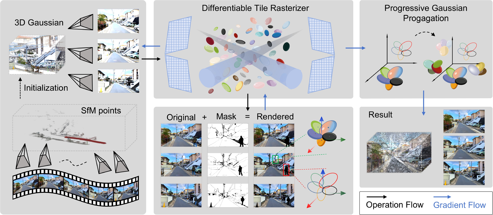

<div align="center">
  <h1 align="center">3D Gaussian Splatting against Moving Objects for High-Fidelity Street Scene Reconstruction</h1>
  <h2 align="center">March 2025</h2>

### [Paper](https://doi.org/10.48550/arXiv.2503.12001) | [web](https://thinkx.ca/research/3dgs/)
</div>


## BibTeX
```
  @article{GaussianMove2025,
    author = {Peizhen Zheng and Longfei Wei and Dongjing Jiang and Jianfei Zhang},
    title = {{3D Gaussian} Splatting against Moving Objects for High-Fidelity Street Scene Reconstruction}
    journal = {arXiv: 2503.12001},
    year = {2025},
    doi = {10.48550/arXiv.2503.12001}
  }
```

<table>
  <tr>
    <td align="center">
      
    </td>
    <td align="center">
      
    </td>
    <td align="center">
      
    </td>
    <td align="center">
      
    </td>
  </tr>
  <tr>
    <td align="center">
      
    </td>
    <td align="center">
      
    </td>
    <td align="center">
      
    </td>
    <td align="center">
      
    </td>
  </tr>
</table>


## 📖 Abstract

<div style="text-align: justify;">
The accurate reconstruction of dynamic street scenes is critical for applications in autonomous driving, augmented reality, and virtual reality. Traditional methods relying on dense point clouds and triangular meshes struggle with moving objects, occlusions, and real-time processing constraints, limiting their effectiveness in complex urban environments. While multi-view stereo and neural radiance fields have advanced 3D reconstruction, they face challenges in computational efficiency and handling scene dynamics. This paper proposes a novel 3D Gaussian point distribution method for dynamic street scene reconstruction. Our approach introduces an adaptive transparency mechanism that eliminates moving objects while preserving high-fidelity static scene details. Additionally, iterative refinement of Gaussian point distribution enhances geometric accuracy and texture representation. We integrate directional encoding with spatial position optimization to optimize storage and rendering efficiency, reducing redundancy while maintaining scene integrity. Experimental results demonstrate that our method achieves high reconstruction quality, improved rendering performance, and adaptability in large-scale dynamic environments. These contributions establish a robust framework for real-time, high-precision 3D reconstruction, advancing the practicality of dynamic scene modeling across multiple applications.
</div>

<div align="left">

## 🗓️ News

<p>[2024.10.10] Many thanks to <a href="https://github.com/wei872">Longfei Wei</a> for the improvements he made to the code</p>

<p>[2024.10.10] Many thanks to <a href="https://github.com/kcheng1021/GaussianPro">GaussianPro</a>, Provide code for the project</p>

<p>Some amazing enhancements will also come out this year.</p>

</div>


<div align="left">

## 🗓️ TODO

- [✔] Code pre-release -- Beta version. 
- [✔] Demo Scenes.
- [✔] <strong>Pybinding & CUDA acceleration</strong>.
- [ ] Support for unordered sets of images.

</div>

<strong>Some amazing enhancements are under development. We warmly welcome anyone to collaborate to improve this repository. Please send me an email if you are interested!</strong>


<div align="left">

## 🚀 Pipeline


</div>


<div align="left">

## 🚀 Setup

#### Tested Environment
window 11, GeForce 4070, CUDA 12.1 (tested), C++17

#### Clone the repo.
```
git clone https://github.com/ThinkXca/3DGS.git --recursive
```

#### Environment setup 
```
conda env create --file environment.yml

pip install ./submodules/Propagation_SSIM

# Don't forget to modify the mask location before running the code. cameras.py 54

python train.py -s data/streeview --eval
python train.py -s data/peoplecarstreeview --eval

```
</div>

<div align="left">

#### Original data source:

<p><a href="https://youtu.be/qv7L0rXFrXk?t=806">Nagoya</a>         <a href="https://www.bilibili.com/video/BV1ij28YqEe8/?spm_id_from=333.337.search-card.all.click&vd_source=c934243e4a837c01c8cd738bde266489&t=73">Quebec</a></p>

</div>

<div align="left">
# Public dataset link:

```
# Nagoya:
https://drive.google.com/file/d/1rblrxazeeSCfnQ7QAUrK7_lLZVu5q54C/view?usp=sharing

# Quebec:
https://drive.google.com/file/d/1XbEOvhHi-3tWbAkUeg2Ecyi8zHMvHsbr/view?usp=drive_link

```

</div>

<div align="left">
# Run the codes: 

```
# The detailed parameter configuration can be found in the paper section.

```
</div>

<div align="left">

#### Try your scenes:

```
# If you want to try your scenes, ensure your images are sorted in the time order, i.e. video data. The current version does not support unordered image sets. Then you can try the commands in demo.sh to run your scenes.

# Please ensure that your neighboring images have sufficient overlap.

```
</div>

<div align="left">

## 🎫 Acknowledgment

This project largely references [3D Gaussian Splatting](https://github.com/graphdeco-inria/gaussian-splatting) and [ACMH/ACMM](https://github.com/GhiXu/ACMH). Thanks for their amazing work!

</div>

